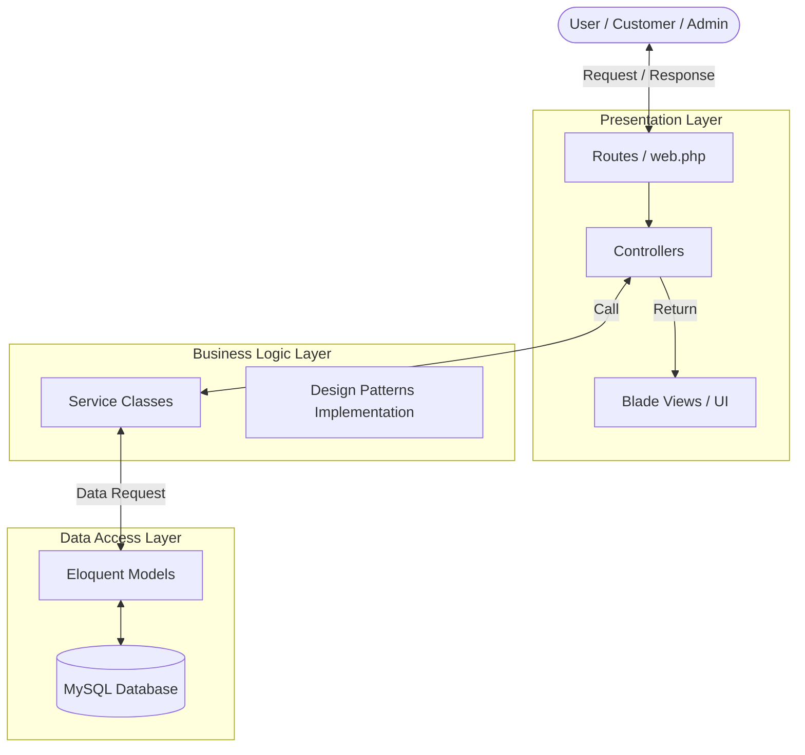
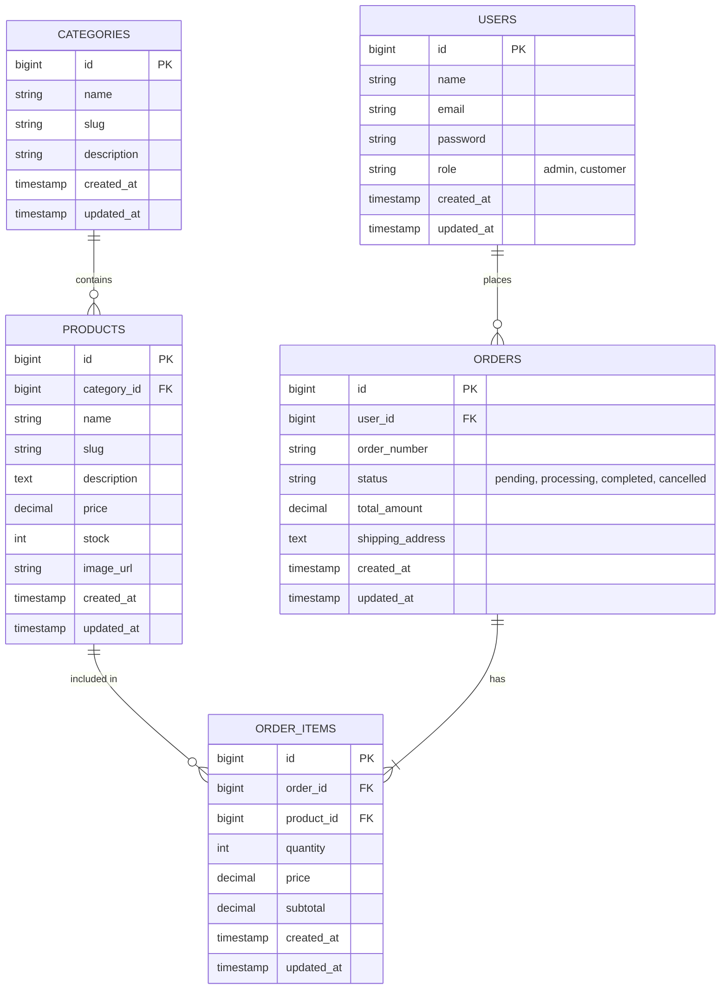

# miniEcommerce - UD Trisna Putra

Aplikasi E-Commerce berbasis web untuk membantu proses belanja kebutuhan bahan kue dan kemasan secara online pada **UD Trisna Putra**.

---

## 1. Deskripsi Project
**miniEcommerce UD Trisna Putra** adalah aplikasi e-commerce yang dikembangkan untuk memperluas jangkauan pasar dan mempermudah pelanggan dalam berbelanja bahan kue, alat baking, serta kemasan plastik. Sistem ini mendigitalisasi katalog produk dan menangani transaksi pemesanan secara terpusat.

Project ini dikembangkan secara komprehensif mulai dari perancangan database, pembuatan sistem autentikasi, manajemen data (CRUD), hingga desain UI yang responsif. Selain fokus pada fitur, pengembangan sistem ini juga menerapkan prinsip-prinsip *Software Engineering* yang baik seperti *Clean Code*, *Layered Architecture*, dan *Design Patterns*.

## 2. Ruang Lingkup Sistem
Sistem ini dirancang untuk dua pengguna utama:
- **Admin**: Bertanggung jawab mengelola katalog produk, kategori, dan melihat pesanan.
- **Customer**: Pengguna akhir yang mencari produk, mengelola keranjang, dan melakukan pemesanan.

## 3. Fitur Utama

### Admin
- **Autentikasi:** Login khusus Admin.
- **Manajemen Kategori:** CRUD data kategori.
- **Manajemen Produk:** CRUD data produk lengkap dengan gambar, harga, dan stok.
- **Manajemen Pesanan:** (Akan datang) Melihat dan memperbarui status pesanan.

### Customer
- **Autentikasi:** Registrasi dan Login akun Customer.
- **Katalog Produk:** Mencari produk, memfilter berdasarkan kategori.
- **Keranjang Belanja:** Menambah/mengubah/menghapus item di keranjang.
- **Checkout & Pesanan:** Melakukan *checkout* dan melihat riwayat pesanan (dengan validasi radius jarak toko).

## 4. Tech Stack
- **Backend:** Laravel 11 (PHP 8)
- **Frontend:** Laravel Blade, Tailwind CSS v3, AlpineJS
- **Database:** MySQL
- **Assets:** Vite

## 5. Arsitektur & Design Patterns
Project ini menerapkan pendekatan **Layered Architecture** di atas fondasi MVC Laravel. Terdapat pemisahan jelas antara *Presentation Layer* (Controllers/Views), *Business Logic Layer* (Services), dan *Data Access Layer* (Models).

### Diagram Arsitektur



Selain itu, project ini mengimplementasikan beberapa Design Pattern (GoF):
- **Singleton Pattern:** Digunakan pada `DistanceService` untuk efisiensi memori (koordinat toko statis).
- **Factory Method Pattern:** Digunakan pada *Role-based redirection* saat user login.

*(Rincian teknis Class Diagram dari Design Patterns dapat dilihat di folder `docs/arsitektur.md`)*

## 6. Database & ERD
Aplikasi ini memiliki tabel utama: `users`, `categories`, `products`, `orders`, dan `order_items`.

### Entity Relationship Diagram (ERD)



*(Penjelasan lengkap mengenai masing-masing tabel tersedia di `docs/database.md`)*

## 7. Cara Menjalankan Project Secara Lokal

1. Clone repositori ini:
   ```bash
   git clone https://github.com/liv-lauflove/miniEcommerce.git
   cd miniEcommerce
   ```
2. Install dependensi PHP dan Node.js:
   ```bash
   composer install
   npm install
   ```
3. Buat file konfigurasi environment:
   ```bash
   cp .env.example .env
   ```
4. Sesuaikan konfigurasi `.env` untuk database, lalu generate *app key*:
   ```bash
   php artisan key:generate
   ```
5. Jalankan migrasi database:
   ```bash
   php artisan migrate
   ```
6. *Build* asset frontend dan jalankan server lokal:
   ```bash
   npm run dev
   php artisan serve
   ```

## 8. Testing, Linter, dan Formatting
Untuk menjaga kualitas dan kerapian kode (*Clean Code*), project ini menggunakan tool standardisasi:
- **Pint (Laravel Code Style):** `./vendor/bin/pint`
- **Testing:** `php artisan test`

## 9. GitFlow dan Conventional Commits
Pengembangan project menggunakan standar **GitFlow** (menggunakan branch `dev`, `main`, dan `feature/*` atau `refactor/*`) dengan metode kolaborasi melalui **Pull Requests (PR)**.
Setiap riwayat perubahan direkam menggunakan standar **Conventional Commits**:
- `feat:` Menambahkan fitur baru.
- `fix:` Memperbaiki bug.
- `refactor:` Merapikan atau mengubah struktur kode (seperti UI Redesign).
- `docs:` Pembaruan dokumentasi.

## 10. Anggota Kelompok dan Kontribusi

| No | Nama | Kontribusi | Link Video |
|---|---|---|---|
| 1 | Olyvia Audy Djohari (42430058)|Pembuatan Fitur Manajemen Data (CRUD) Admin, Pembuatan Katalog Produk dan Dashboard Customer| https://drive.google.com/drive/folders/1l3MB-fhEq6o1WiiNhLrqGYjxHo29BlO6?usp=sharing|
| 2 | Ni Komang Dewi Mahayani(42430028)| Registrasi, Login, Logout, Manajemen Role User, Riwayat Pesanan | https://drive.google.com/drive/folders/1XZn09LYDvnO967SLjclgFk-eiVJEa_Qa?usp=sharing |
| 3 | Gede Troy Wiswama Bhareswara (42430052)| Implementasi Fitur Geolokasi Real-Time (perhitungan jarak toko ke user pada proses checkout), penerapan Singleton Pattern pada DistanceService, serta integrasi Dependency Injection di CheckoutController | https://drive.google.com/drive/folders/1zOAc1ANN0H_nvk7L-PUSA8kHk417HYHr?usp=drive_link |
| 4 | Meizaluna Aurelia Frakasa (42430045)| Pengembangan Fitur Manajemen Pesanan, Dashboard Owner, Pengelolaan Status Pesanan, dan Monitoring Data Penjualan| https://drive.google.com/file/d/1B9KxipBRpwq8CT1go4xQ66e7BAskyQEw/view?usp=drivesdk|
| 5 |Gede Sathya Pratama Deva (42430056) | fitur check out, validasi stock barang, proses transaksi pesanan|https://drive.google.com/drive/folders/15alryhk8k4R1Ske4LEgXdwq5CfiGwXlA|

---

