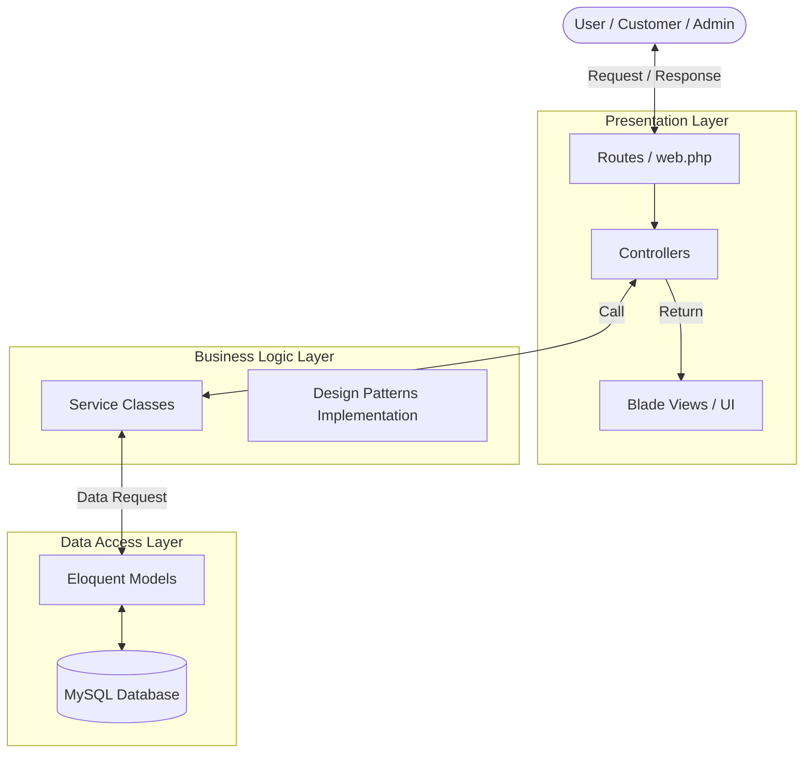
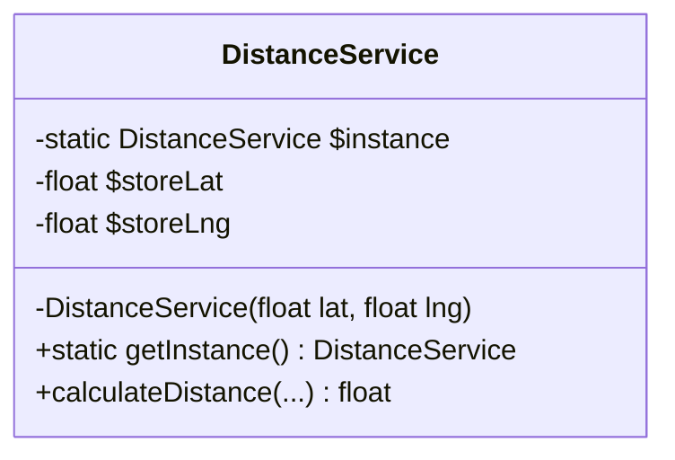
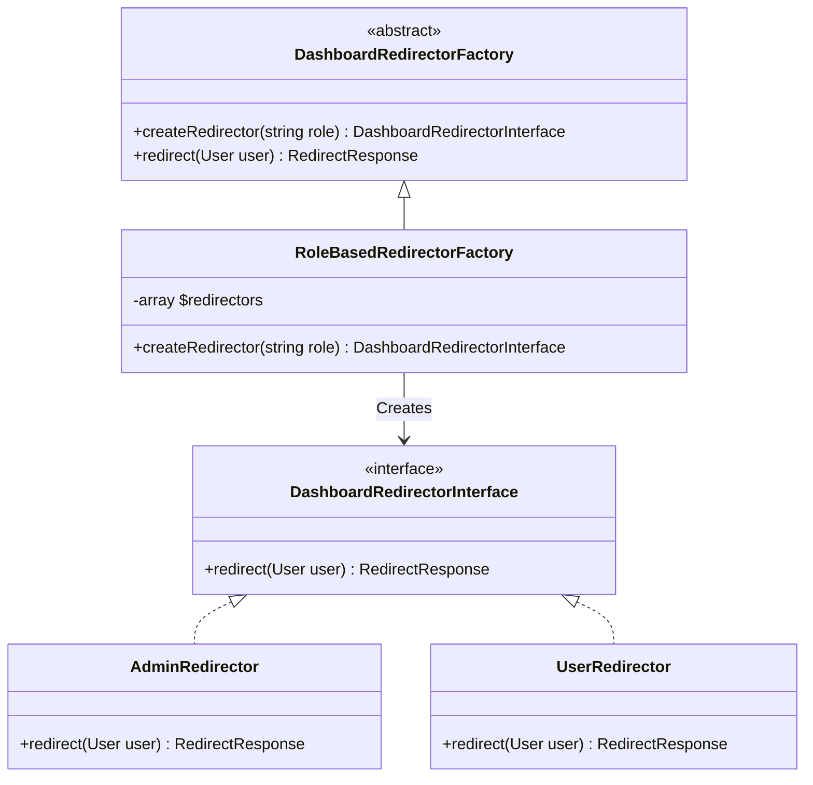

# Arsitektur & Design Patterns

## 1. Arsitektur Sistem (MVC & Service Layer)

Aplikasi **miniEcommerce UD Trisna Putra** dibangun menggunakan framework Laravel yang secara bawaan mengadopsi pola arsitektur **MVC (Model-View-Controller)**. Namun, untuk menjaga *Clean Code* dan skalabilitas, aplikasi ini menambahkan **Service Layer** sehingga memisahkan logika bisnis dari Controller.

### Penjelasan Layer:
- **Presentation Layer**: Menangani interaksi dengan pengguna (request & response), validasi awal, dan *rendering* UI (Blade templates).
- **Business Logic Layer**: Tempat berjalannya aturan bisnis (contoh: logika kalkulasi jarak, pembuatan redirector, logika *checkout*).
- **Data Access Layer**: Model Eloquent yang memetakan objek ke tabel database MySQL.

---

## 2. Design Patterns

Proyek ini mengimplementasikan beberapa Design Pattern (GoF) untuk memecahkan masalah arsitektural secara elegan:

### A. Singleton Pattern
Digunakan pada `DistanceService` karena titik koordinat lokasi toko selalu sama dan statis selama runtime.

### B. Factory Method Pattern
Digunakan pada proses *Role-Based Redirection* setelah pengguna login.

### C. Strategy Pattern
*(Jika diimplementasikan pada kalkulasi harga diskon atau metode pengiriman)*
Digunakan untuk menukar algoritma secara dinamis pada saat *runtime* tanpa mengubah kode pemanggil.

### D. Observer Pattern
*(Jika diimplementasikan pada notifikasi email/stok)*
Digunakan untuk memicu serangkaian tindakan (seperti mengirim email/notifikasi) ketika suatu *event* (misal: pesanan baru dibuat) terjadi.
