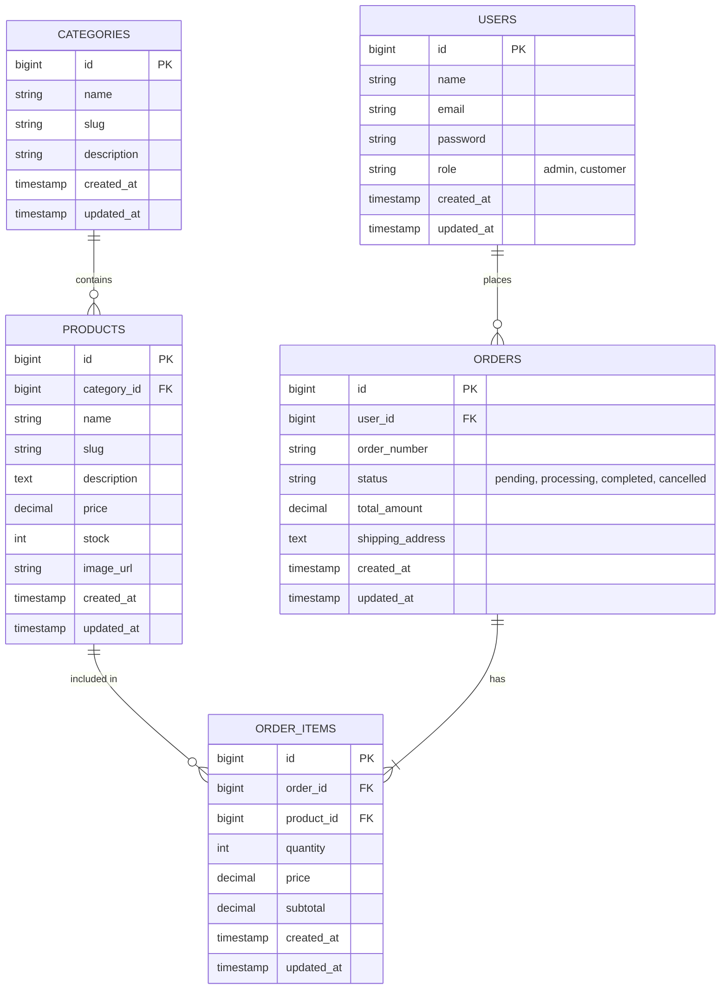

# Entity Relationship Diagram (ERD)

Berikut adalah struktur relasi database untuk sistem **miniEcommerce UD Trisna Putra**.

### Penjelasan Tabel:
1. **users**: Menyimpan data akun pengguna baik *Admin* maupun *Customer*. Role menentukan hak akses sistem.
2. **categories**: Menyimpan kategori produk (misal: Bahan Kue, Plastik, Kemasan).
3. **products**: Menyimpan detail produk beserta stok dan harga. Berelasi langsung dengan tabel `categories`.
4. **orders**: Menyimpan data transaksi pesanan secara umum (header).
5. **order_items**: Menyimpan detail produk apa saja yang dibeli pada sebuah order (detail).
